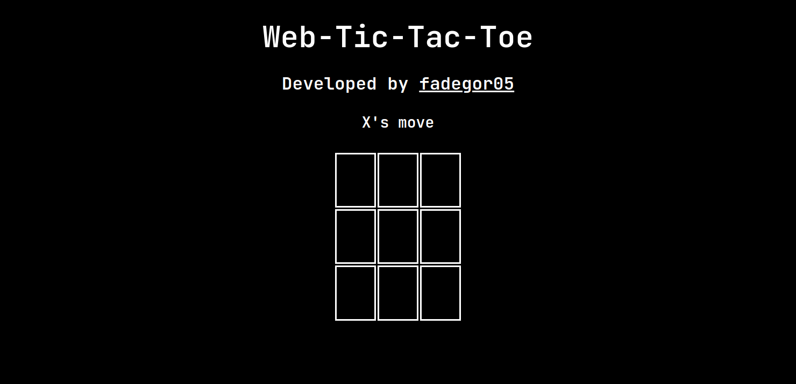

# Web-Tic-Tac-Toe

It's a simple tic-tac-toe, which was based on <b>HTML</b>, <b>JS</b> and <b>CSS</b>. It's one by one game, so you need to play it in order.

<b>You can try it out</b> <a href="https://fadegor05.github.io/Web-Tic-Tac-Toe">here<a>

### Dependencies

- <a href="https://necolas.github.io/normalize.css/8.0.1/normalize.css">Normalize.css</a>

